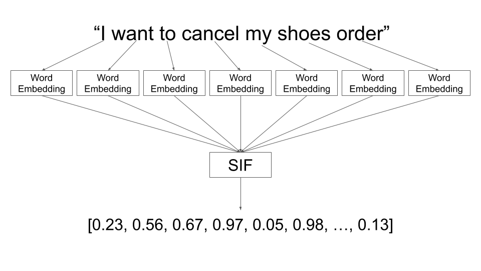

We are going to use the *text* package in R (R version 4.3.1; Kjell et al., 2023) to generate sentence embeddings and measure the cosine similarity between pieces of text (img source: https://www.kaggle.com/code/oybekeraliev/word-and-sentence-embeddings-tutorial-from-zero). 

```{r}

```

Let's start by installing the *text* package. This is going to take some time because it involves creating a conda environment (a type of virtual environment that you can use to manage R and python packages) and installing a few python packages in that environment. 

Another tutorial and a detailed installation guideline can be found on their package website: https://r-text.org/

```{r}
# install.packages("text")
library(text)
# textrpp_install()
# textrpp_initialize(save_profile = TRUE)
```

For demonstration purposes, let's induce sentence embeddings of three sentences. Supposedly, sentence embedding encode semantic and syntactic information of sentences. Hence, we would expect the embedding of *str1* to be more similar to that of *str2* compared to *str3*. 

```{r}
str1 = c("In academic writing, chatbots can be employed to provide instant feedback on grammar and citation styles, enhancing the quality of research papers.")

str2 = c("In scholarly compositions, chatbots can offer real-time critiques on structure and referencing, elevating the standard of the manuscripts.")

str3 = c("Chatbots, despite their code-based nature, cannot appreciate the emotional depth of a classic novel.")
```

Now, we are going to generate sentence embeddings for the three sentences. This is done using the *textEmbed()* function. 

```{r}
embed1 = textEmbed(str1)
embed2 = textEmbed(str2)
embed3 = textEmbed(str3)
```

You will notice that *embed1*, *embed2*, and *embed3* are list objects. Inside the list object is "tokens" and "texts". The *textEmbed()* function creates embeddings of tokens as well as the entire text. Here, we don't need the token embeddings, so we are going to focus on the "texts" element of the list: 

```{r}
as.numeric(unlist(embed1$texts))
```

What you see is a numeric vector of 768 dimensions. That is the sentence embedding of *str1*. By default, the model that the *text* package uses is the "bert-base-uncased" model which is of 768 dimensions. 

All confounds aside, if sentence embeddings encode contextual information and semantics, we would expect the first and second sentence embeddings to be more similar to each other because they both talk about the utility of chatbots for writing as opposed to the first and third sentence embeddings. We can quantify the similarity of these embeddings using cosine similarity which is the cosine of the angle between these two numeric vectors: 

```{r}
# install.packages("lsa")
library(lsa)
cosine(as.numeric(unlist(embed1$texts)), as.numeric(unlist(embed2$texts)))
```

And compare it to the cosine similarity between *str1* and *str3*. 

```{r}
cosine(as.numeric(unlist(embed1$texts)), as.numeric(unlist(embed3$texts)))
```

```{r}
cosine(as.numeric(unlist(embed2$texts)), as.numeric(unlist(embed3$texts)))
```

